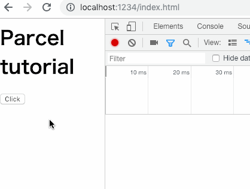
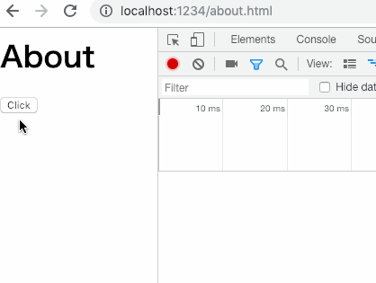

# Code Splitting という機能を利用して、共通利用できるモジュールのバンドルファイルを出力するサンプル

このサンプルでは、エントリーポイントである`index.html`と`about.html`が存在し、`index.html`からは`index.js`を、`about.html`からは`about.js`を読み込んでいる。

また、`index.js`と`about.js`では`render.js`を利用しており、これを共通利用できるモジュールのバンドルファイルとして出力する。

モジュールである`render.js`は以下の処理を行なっている。

```js
console.log('module.js loaded');

export function render(element) {
  element.innerHTML = 'clicked!!!!!';
}
```

モジュールは dynamic import でインポートする必要がある（詳しくはコードを参照）ので以下のように動的に読み込まれる。

**index.html**



**about.html**



リクエスト先が同じであり、clicked!!!!! も描画されているため、どちらも共通のバンドルファイル（モジュール）が読み込まれていることがわかる。

## ビルド

```shell
parcel src/index.html src/about.html -d public
```
